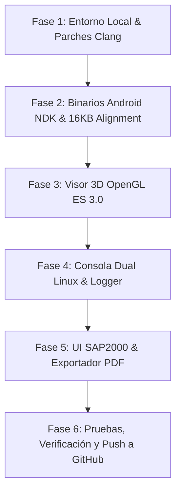

# Plan de Desarrollo: Aplicación Profesional de Cálculo Estructural Estilo SAP2000 para Android NDK

**Proyecto:** Structural and Seismic Research (CalculoCivil)  
**Objetivo:** Construir una aplicación Android NDK profesional de análisis y diseño estructural 3D inspirada en software de grado industrial como SAP2000 y ETABS, impulsada por el motor nativo **OpenSees** (Tcl y Python OpenSeesPy) con renderizado en tiempo real **OpenGL ES 3.0**, consola interactiva estilo Linux, generación de reportes en PDF e interfaz completamente en inglés técnico.

---

## 🏛️ 1. Arquitectura General y Requisitos del Sistema

### 1.1 Configuración del AndroidManifest.xml
- **Soporte de Gráficos Nativos:** Requerir OpenGL ES 3.0 mediante `<uses-feature android:glEsVersion="0x00030000" android:required="true" />`.
- **Estructura de Actividades:**
  - `MainActivity.java`: Actividad principal con navegación por pestañas (UI de Definición, Visor 3D OpenGL ES 3.0, Consola Interactiva Dual).
  - `AboutActivity.java`: Información del software, licencias permisivas y exención de responsabilidad de UC Berkeley.
  - `PrivacyPolicyActivity.java`: Términos de privacidad y políticas de uso local de datos con enlace placeholder (`https://diamon.com/privacy-policy`).
- **Permisos:** Gestión de archivos de almacenamiento privado y carpetas de la aplicación.

### 1.2 Estándar de Terminología de Ingeniería (UI en Inglés)
Toda la interfaz de usuario usará términos estándar de la ingeniería civil y estructural:
- **Geometry & Topology:** Nodes, Joint Coordinates, Frame Elements, Shell/Plate Elements, Mesh Grid.
- **Materials:** Concrete C30/35, Structural Steel A992 / A36, Rebar A615 Grade 60, Elastic Isotropic.
- **Sections & Profiles:** I-Shapes / W-Beams, Rectangular Concrete Columns, Steel Pipes, Box Sections.
- **Loads & Cases:** Dead Load (DL), Live Load (LL), Earthquake Loads (EQX, EQY), Response Spectrum (IBC/ASCE7), Time History (Ground Acceleration TH).
- **Analysis Types:** Linear Static, Eigenvalue Modal Analysis, P-Delta Analysis, Nonlinear Static Pushover, Direct Integration Transient Analysis.
- **Results & Output:** Displacements ($U_x, U_y, U_z$), Axial Force ($P$), Bending Moments ($M_{22}, M_{33}$), Shear Forces ($V_{22}, V_{33}$), Torsion ($T$), Stress Contours ($\sigma_{max}$), Mode Shapes & Natural Periods ($T_i$).

---

## 🎨 2. Diseño de Interfaz y Navegación por Pestañas (Tab Navigation)

La pantalla principal se organizará en una navegación limpia y moderna basada en 3 pestañas principales:

```
+-----------------------------------------------------------------------+
|  [Tab 1: Structural Model]  [Tab 2: 3D Viewer]  [Tab 3: Terminal & Log]|
+-----------------------------------------------------------------------+
```

### Pestaña 1: Structural Model & Definition (Definición del Modelo)
- **Node & Element Definition Cards:** Formulario interactivo para ingresar coordenadas de nudos y conectividad de elementos frame/shell.
- **Material & Section Assigner:** Selectores visuales para propiedades de materiales y perfiles de sección transversal.
- **Load Patterns & Combinations:** Editor de cargas puntuales, distribuidas y aceleraciones sísmicas.
- **Script Editor Box:** Editor de código Tcl/Python integrado con numeración de líneas y botón de ejecución instantánea.
- **Import/Export Controls:** Botones para importar scripts externos `.tcl` o `.py` y guardar el modelo actual.

### Pestaña 2: 3D OpenGL ES 3.0 Structural Viewer (Visor 3D estilo SAP2000)
- **Motor de Renderizado:** Desarrollado con `GLSurfaceView` y un shader pipeline nativo en OpenGL ES 3.0.
- **Visualización Geométrica:**
  - Nudos en 3D con colores representativos de condiciones de apoyo (Empotrado, Articulado, Rodillo).
  - Elementos tipo barra (Frame) renderizados en estructura alámbrica (wireframe) o con extruido tridimensional de su sección transversal.
  - Malla de elementos tipo cascarón (Shell/Plate).
- **Visualización de Resultados Pos-Procesamiento:**
  - Deformada tridimensional con factor de escala ajustable.
  - Modos de vibración animados para análisis modal.
  - Diagramas de momentos flectores ($M_{33}$) y fuerzas cortantes ($V_{22}$).
  - Barra de escala cromática de esfuerzos y desplazamientos (Color Spectrum Legend).
  - Controles táctiles: Rotación orbital (Orbit), Panorámica (Pan) y Zoom con gestos multi-touch.

### Pestaña 3: Linux-Style Dual Console & Real-time Logger (Consola e Intérprete)
- **Aesthetic Terminal UI:** Texto verde matriz sobre fondo negro profundo (`#00FF00` sobre `#0A0A0A`), fuente monoespaciada (`Typeface.MONOSPACE`), cursor parpadeante y texto 100% copiable al portapapeles.
- **Comandos de Consola Tipo Linux Soportados:**
  - `help`: Muestra la lista de comandos disponibles y sintaxis.
  - `clear`: Limpia la pantalla de la consola.
  - `ls`, `ls -a`: Lista archivos en el directorio interno de la aplicación.
  - `mkdir <dir>`: Crea un nuevo directorio de trabajo.
  - `rm <file>`, `rm -rf <dir>`: Elimina archivos o carpetas.
  - `cat <file>`: Muestra el contenido de un script o log.
  - `pwd`: Muestra el directorio de trabajo actual.
  - `run-tcl <script>` / `run-py <script>`: Ejecuta un script OpenSees.
- **Scripts de Prueba pre-instalados en Assets:**
  - `test_cantilever.tcl`: Análisis estático de una viga en voladizo con carga puntual.
  - `test_portal_frame.py`: Análisis sísmico y modal de un pórtico 2D con OpenSeesPy.
- **Botones de Ejecución Rápida (Quick Action Test Buttons):**
  - Botón **"Run TCL Test"**: Copia y ejecuta `test_cantilever.tcl` en OpenSees Tcl.
  - Botón **"Run Python Test"**: Copia y ejecuta `test_portal_frame.py` en OpenSeesPy.
- **Captura de Logcat y Errores Reales de la App:**
  - Capturador automático de `stdout` y `stderr` de los binarios de OpenSees.
  - Capturador de excepciones Java y fallos nativos NDK (señales `SIGSEGV`, `SIGFPE`) presentado en la consola para depuración directa en el dispositivo.

---

## 📄 3. Exportación de Reportes Profesionales en PDF

Integración mediante `android.graphics.pdf.PdfDocument` para generar memorias de cálculo completas:
1. **Encabezado del Proyecto:** Nombre del proyecto, Ingeniero responsable, Fecha, Ubicación y Licencia.
2. **Resumen de Propiedades:** Tabla de materiales utilizados, perfiles de sección e hipótesis de carga.
3. **Resultados Tabulados:**
   - Desplazamientos máximos por nudo ($U_x, U_y, U_z$).
   - Fuerzas internas en barras (Carga Axial $P$, Cortante $V$, Momento $M$).
   - Períodos fundamentales y masas participativas del análisis modal.
4. **Captura del Modelo 3D:** Renderizado estático del visor OpenGL ES 3.0 incrustado en el documento PDF.

---

## 🛠️ 4. Configuración del Entorno de Pruebas Local en Linux

Para validar los scripts Tcl y Python OpenSeesPy localmente antes de empaquetarlos en la aplicación Android:

### 4.1 Entorno Aislado de Python 3.11
- Compilado e instalado localmente en `$HOME/.local_python311` sin alterar el Python por defecto del sistema (`Python 3.12`).
- Creación de entorno virtual `venv`:
  ```bash
  $HOME/.local_python311/bin/python3.11 -m venv $HOME/opensees_env
  source $HOME/opensees_env/bin/activate
  ```

### 4.2 Compilación Local de OpenSees y OpenSeesPy
- Binario OpenSees Tcl compilado con parches de compatibilidad `TCL_Char` y Tcl 8.6.
- Módulo `opensees.so` (OpenSeesPy) instalado en el `site-packages` de Python 3.11 local.

---

## 🗺️ 5. Hoja de Ruta de Implementación (Fases del Proyecto)



### Fase 1: Entorno de Pruebas Local en Linux
1. Finalizar instalación aislada de Python 3.11 en `$HOME/.local_python311`.
2. Validar ejecución local de OpenSees Tcl y OpenSeesPy con scripts de prueba (`test_cantilever.tcl` y `test_portal_frame.py`).

### Fase 2: Configuración del Proyecto Android NDK
1. Actualizar `AndroidManifest.xml` con OpenGL ES 3.0 y actividades `AboutActivity` y `PrivacyPolicyActivity`.
2. Estructurar archivos de assets con los scripts de prueba.

### Fase 3: Renderizador 3D OpenGL ES 3.0
1. Crear `Structural3DRenderer.java` implementando shaders de vértices y fragmentos en OpenGL ES 3.0.
2. Implementar cámaras 3D con proyección perspectiva/ortográfica y matriz MVP.
3. Renderizado de líneas (elementos frame), puntos (nudos) y mallas cromáticas (deformada/esfuerzos).

### Fase 4: Consola Interactiva y Registro de Fallos
1. Implementar `LinuxTerminalView.java` con diseño verde matriz sobre negro y fuente monoespaciada.
2. Crear el parser de comandos de shell (`help`, `clear`, `ls`, `mkdir`, `rm`, `cat`, `pwd`, etc.).
3. Conectar la consola con `OpenSeesExecutor.java` para capturar la salida de OpenSees y el logcat nativo del NDK.

### Fase 5: UI de Selección Estructural y Generador PDF
1. Construir pantallas en inglés para ingresar nudos, barras, materiales y cargas.
2. Implementar `PDFReportGenerator.java` para exportar reportes de ingeniería profesionales.

### Fase 6: Verificación, Compilación y Control de Versiones
1. Ejecutar `./gradlew assembleDebug` para validar la compilación sin errores.
2. Registrar los cambios en Git y realizar `git push` al repositorio de GitHub.
